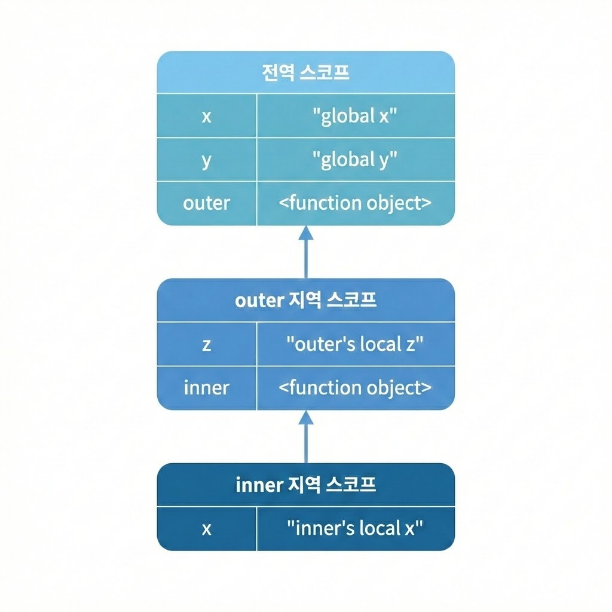

# 스코프 체인

- 스코프가 계층적으로 연결된 것을 의미함

- 스코프 체인은 최상위 스코프인 전역 스코프, 전역에서 선언된 outer 함수의 지역 스코프, outer 함수 내부에서 선언된 inner 함수의 지역 스코프로 이루어짐

- 변수를 참조할 때 JS엔진은 스코프 체인을 통해 변수를 참조하는 코드의 스코프에서 시작하여 상위 스코프 방향으로 이동하며 **선언된 변수를 검색(Identifier resolution)**함<br/>
  -> 이를 통해 상위 스코프에서 선언한 변수를 하위 스코프에서도 참조할 수 있음

## 스코프 체인은 물리적으로 존재하는가?

- 스코프 체인은 물리적인 실체로서 존재함
- JS 엔진은 코드(전역 코드와 함수 코드)를 실행하기에 앞서
   이 그림과 유사한 자료구조인 `Lexical Environment`를 실제로 생성한다.

- 변수 선언이 실행되면 변수 식별자가 `Lexical Environment`을 실제로 생성한다.<br/> 변수 선언이 실행되면 변수 식별자가 `이 자료구조 (Lexical Environment)`에 key로 등록되고, 변수 할당이 일어나면 `이 자료구조 (Lexical Environment)`의 변수 식별자에 해당하는 값을 변경한다.
- 변수의 검색 또한 `이 자료구조 (Lexical Environment)`상에서 이루어진다.

## Lexical Environment

- 스코프 체인은 Execution Context와 `Lexical Environment`를 단방향으로 `연결(Chain)`한 것이다.

- `Global Lexical Environment`는 코드가 로드되면 곧바로 생성되고 함수와 `Lexical Environment`는 함수가 호출되면 곧바로 생성된다.

## 스코프 체인에 의한 변수 검색

- JS엔진은 스코프 체인을 따라서 변수를 참조하는 코드의 스코프에서 시작해서 상위 스코프 방향으로 이동하며 선언된 변수를 검색한다.
  (절대 하위 스코프로 내려가면서 식별자를 검색하는 일은 없다)

- 이는 `상위 스코프에서 유효한 변수는 하위 스코프에서 자유롭게 참조할 수 있지만 하위 스코프에서 유효한 변수를 상위 스코프에서 참조할 수 없다`는 것을 뜻한다.

- 스코프 체인으로 연결된 스코프의 계층적 구조는 부자 관계로 이루어진 상속과 유사하다. <br/>따라서 상속을 통해 부모의 자산을 자식이 자유롭게 사용할 수 있지만 자식의 자산을 부모가 사용할 수는 없는 것과 스코프 체인도 유사하게 동작을 한다고 생각하면 된다.

## 스코프 체인에 의한 함수 검색

```js
function foo() {
  console.log("global function foo");
}

function bar() {
  // 중첩 함수
  function foo() {
    console.log("local function foo");
  }

  foo();
}

bar();
```

- 함수 선언문으로 함수를 정의하는 경우, 런타임 이전에 함수 객체가 먼저 생성된다.<br/> 그리고 JS엔진은 함수명과 동일한 이름의 식별자를 암묵적으로 선언하고 생성된 함수 객체를 할당한다.

# identifier resolution (변수 검색)

- **식별자 해결(Identifier Resolution)**은
  자바스크립트 엔진이 변수(식별자)의 값을 찾아 반환하는 과정이다.<br/>
  즉, “x라는 이름을 어떻게 찾아서 실제 값에 도달하나?”를 설명한다.
